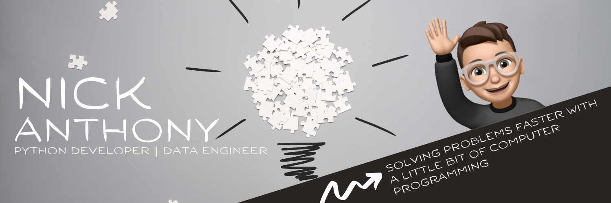

I'm Nick and I like to build software.

- 👨‍💻 Check-out my [Website](https://nanthony007.github.io/)!
- 📃 Check-out my [Blog](https://medium.com/@nanthony007)!
- 🌱 I’m currently learning Go and React
- 👯 I’m looking to collaborate on open-source Python projects
- 💬 Ask me about: Anything 😊
- 📫 How to reach me: nanthony007@gmail.com


## About Me

```go
type AboutMe struct {
	passions []string
	hobbies  []string
	family   map[string]string
	codingLevels   map[string]string  // use climbing scale of VB-V10
}

nick := AboutMe{
  []string{"Nature", "Photography", "Mountains", "Oceans", "A Good Cup of Coffee"},
  []string{"Gaming", "Reading", "Writing", "Hiking", "Rock Climbing"},
  map[string]string{
    "wife":   "@mduong26",
    "pupper": "Kingsley",
  },
  map[string]string{
    "go": "v3",
    "python": "v9",
    "vue": "v5"
  }
}
```


## Tools


## GitHub Stats


[](https://github.com)

